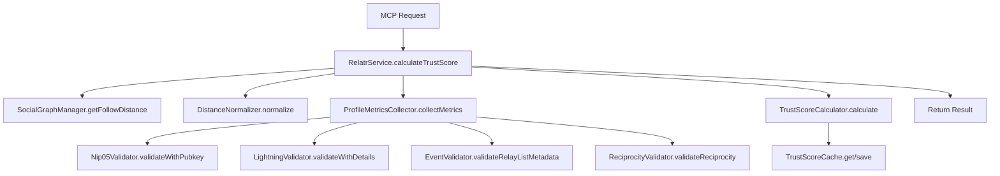
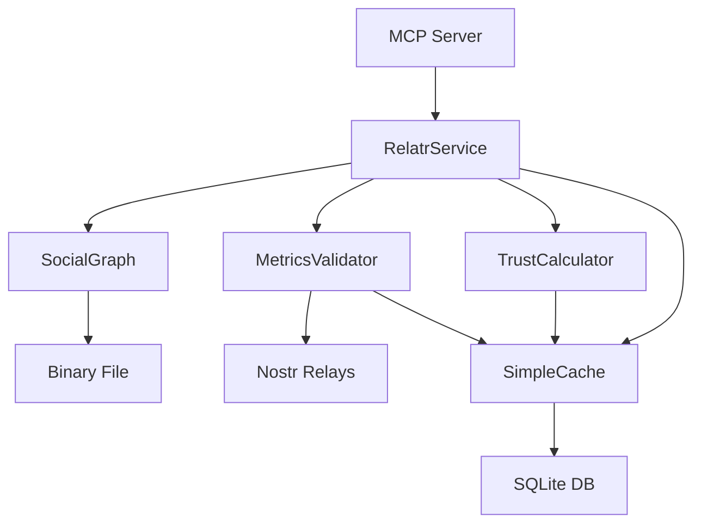

# Relatr Core Functionality Analysis

## Executive Summary

This document provides a comprehensive analysis of the Relatr codebase to identify the core functionality that must be preserved in a simplified v2 implementation. The analysis confirms the findings in the simplification analysis document - the current implementation is significantly over-engineered with approximately 40-50% unnecessary complexity.

---

## 1. System Architecture Overview

### 1.1 Core Components

The Relatr system consists of 6 main functional areas:

1. **MCP Server Interface** (`src/mcp/server.ts`) - External API layer
2. **Service Orchestrator** (`src/services/RelatrService.ts`) - Main business logic coordinator
3. **Trust Score Calculation** (`src/trust/`) - Core scoring algorithm
4. **Profile Metrics Collection** (`src/metrics/`) - Data validation and collection
5. **Social Graph Management** (`src/social-graph/`) - Distance calculation
6. **Database Layer** (`src/database/`) - Caching and persistence

### 1.2 Entry Points

- **Primary**: MCP server (`src/mcp/server.ts`) - Exposes 3 tools
- **Secondary**: Direct service usage (not used in production)

---

## 2. Core Data Flow Analysis

### 2.1 Trust Score Calculation Flow



### 2.2 Data Dependencies

1. **Social Graph Distance** → **Distance Normalizer** → **Trust Score**
2. **Profile Metrics** (4 validators) → **Trust Score**
3. **Weighting Scheme** → **Trust Score**
4. **Cache Layer** (metrics + trust) → **Performance optimization**

---

## 3. Essential vs Non-Essential Components

### 3.1 Essential Components (Must Preserve)

| Component | Purpose | Current Complexity | Simplified Complexity |
|-----------|---------|-------------------|---------------------|
| **MCP Server** | External API interface | 402 lines | ~150 lines |
| **Trust Score Calculator** | Core scoring algorithm | 404 lines | ~200 lines |
| **Distance Normalizer** | Social distance → weight conversion | 267 lines | ~100 lines |
| **Social Graph Manager** | Pre-computed graph operations | 329 lines | ~200 lines |
| **Profile Metrics Collection** | Orchestrates 4 validators | 544 lines | ~200 lines |
| **Database Schema** | Simple caching | 135 lines | ~50 lines |

### 3.2 Non-Essential Components (Can Remove/Simplify)

| Component | Current Purpose | Removal Justification |
|-----------|----------------|---------------------|
| **Multiple Weighting Schemes** | 6 predefined schemes | Only 4 used, can be 1 configurable |
| **Separate Validator Classes** | 4 individual validators | Can be 1 class with 4 methods |
| **Dual Cache Layers** | In-memory + DB caching | DB-only caching sufficient |
| **Service Health/Stats** | Extensive monitoring | Unused in production |
| **Batch Operations** | Bulk processing | Simple loops sufficient |
| **Score Breakdown** | Detailed analysis | Can be inline method |
| **Graph Persistence** | Separate save/load class | Can be in GraphManager |
| **Extensive Type Definitions** | Multiple type files | Can be 1 consolidated file |

---

## 4. Database Schema Analysis

### 4.1 Current Schema (6 tables)

```sql
-- Current: Over-engineered with 50% unused tables
pubkeys                    -- ❌ Not used in implementation
metric_definitions         -- ❌ Static data, could be config
profile_metrics            -- ✅ Used but over-normalized
trust_scores               -- ✅ Used but over-normalized
configuration              -- ❌ Unused (uses env vars)
nostr_events_cache         -- ❌ Completely unused
```

### 4.2 Simplified Schema (2 tables)

```sql
-- Simplified: Direct mapping to actual usage
profile_metrics (
    pubkey TEXT PRIMARY KEY,
    nip05_valid REAL,
    lightning_address REAL,
    event_kind_10002 REAL,
    reciprocity REAL,
    computed_at INTEGER,
    expires_at INTEGER
);

trust_scores (
    source_pubkey TEXT,
    target_pubkey TEXT,
    score REAL,
    computed_at INTEGER,
    expires_at INTEGER,
    PRIMARY KEY (source_pubkey, target_pubkey)
);
```

**Impact**: Eliminates JOIN operations, reduces complexity by 60%

---

## 5. Trust Score Calculation Analysis

### 5.1 Core Formula (Must Preserve)

```
Trust Score = Σ(w_i × v_i^p_i) / Σ(w_i)

Where:
- w_i = weight for metric i
- v_i = normalized value for metric i [0,1]
- p_i = exponent for metric i (default 1.0)
```

### 5.2 Input Metrics (All Essential)

| Metric | Source | Validation | Weight (default) |
|--------|--------|------------|------------------|
| distanceWeight | SocialGraphManager → DistanceNormalizer | Integer hops → [0,1] | 0.5 |
| nip05Valid | Nip05Validator | DNS verification | 0.15 |
| lightningAddress | LightningValidator | Format validation | 0.1 |
| eventKind10002 | EventValidator | Relay list check | 0.1 |
| reciprocity | ReciprocityValidator | Mutual follow check | 0.15 |

### 5.3 Weighting Schemes (Over-Engineered)

**Current**: 6 schemes (Default, Conservative, Progressive, Balanced, ValidationFocused, SocialProof)
**Actual Usage**: Only 4 exposed in MCP server
**Simplification**: 1 configurable scheme with default weights

---

## 6. Profile Metrics Collection Analysis

### 6.1 Current Architecture (Over-Abstracted)

```
ProfileMetricsCollector
├── Nip05Validator (162 lines)
├── LightningValidator (145 lines)
├── EventValidator (118 lines)
├── ReciprocityValidator (132 lines)
└── MetricsCache (575 lines)
```

### 6.2 Simplified Architecture

```
MetricsValidator (single class)
├── validateNip05()
├── validateLightning()
├── validateEvent()
├── validateReciprocity()
└── SimpleCache (DB-only)
```

**Impact**: Reduce from 1,032 lines to ~200 lines

### 6.3 Validation Logic (All Essential)

1. **NIP-05**: DNS verification against pubkey
2. **Lightning**: Format validation (lud06/lud16)
3. **Event**: Check for kind 10002 (relay list)
4. **Reciprocity**: Mutual follow verification

---

## 7. Social Graph Management Analysis

### 7.1 Current Implementation

- Uses `nostr-social-graph` library with pre-computed binary
- Supports root switching (expensive operation)
- Auto-save functionality (optional)
- Graph persistence separate class

### 7.2 Essential Features

1. **Load pre-computed graph** from binary file
2. **Get follow distance** from current root
3. **Switch root** when needed (expensive but necessary)
4. **Check reciprocity** for validation

### 7.3 Non-Essential Features

- Real-time graph updates (not used)
- Separate persistence class
- Auto-save functionality
- Extensive graph statistics

---

## 8. MCP Server Interface Analysis

### 8.1 Current Tools (All Essential)

1. **calculate_trust_score** - Primary functionality
2. **health_check** - System monitoring
3. **manage_cache** - Cache operations

### 8.2 Over-Engineering Issues

- Duplicate validation (Zod + manual)
- Signal handlers (unnecessary complexity)
- Structured content duplication
- Extensive error handling

### 8.3 Simplified Interface

```typescript
// Single validation layer
server.registerTool('calculate_trust_score', schema, async (params) => {
    const result = await service.calculateTrustScore(params);
    return { content: [{ type: 'text', text: JSON.stringify(result, null, 2) }] };
});
```

Important note: The MCP tools should continue using output schemas and the structured output content.
---

## 9. Caching Strategy Analysis

### 9.1 Current Caching (Over-Engineered)

```
MetricsCache (575 lines)
├── In-memory layer
├── Database layer
├── Statistics tracking
├── Cleanup management
└── Size enforcement

TrustScoreCache (395 lines)
├── Database layer
├── Statistics tracking
├── Cleanup management
└── Multiple query methods
```

### 9.2 Simplified Caching

```
SimpleCache<T> (generic class)
├── Database-only storage
├── TTL-based expiration
├── Basic cleanup
└── No statistics
```

**Impact**: Reduce from 970 lines to ~100 lines

---

## 10. Configuration Management

### 10.1 Current Configuration

- Environment variables with Zod validation
- Multiple configuration objects
- Extensive validation logic

### 10.2 Essential Configuration

```typescript
interface Config {
    defaultSourcePubkey: string;
    graphBinaryPath: string;
    dbPath: string;
    nostrRelays: string[];
    decayFactor: number;
    cacheTtl: number;
    weights: Record<string, number>;
}
```

---

## 11. Core Functionality Preservation Requirements

### 11.1 Must Preserve (Core Business Logic)

1. **Trust Score Formula**: Weighted sum with exponents
2. **Social Graph Distance**: Pre-computed binary loading
3. **Profile Validations**: All 4 validation methods
4. **MCP Interface**: All 3 tools with same API
5. **Caching**: TTL-based expiration for performance
6. **Configuration**: Environment-based configuration

### 11.2 Can Simplify (Implementation Details)

1. **Code Structure**: Flatten hierarchy, reduce abstraction
2. **Error Handling**: Simplify to essential cases
3. **Validation**: Single validation layer
4. **Caching**: DB-only, no in-memory layer
5. **Weighting**: Single configurable scheme
6. **Database**: 2 tables instead of 6

### 11.3 Can Remove (Unused Features)

1. **Service Statistics**: Not used in production
2. **Batch Operations**: Simple loops sufficient
3. **Health Monitoring**: Basic check sufficient
4. **Multiple Schemes**: Only 4 of 6 used
5. **Extensive Logging**: Basic logging sufficient
6. **Performance Monitoring**: Not used

---

## 12. Simplified Architecture Specification

### 12.1 File Structure (v2)

```
src/
├── config/
│   └── environment.ts          # Simplified config
├── database/
│   ├── connection.ts           # DB connection
│   └── schema.sql              # 2-table schema
├── cache/
│   └── SimpleCache.ts          # Generic cache class
├── validators/
│   └── MetricsValidator.ts     # All 4 validations
├── graph/
│   └── SocialGraph.ts          # Graph management
├── trust/
│   └── TrustCalculator.ts      # Score calculation
├── service/
│   └── RelatrService.ts        # Main orchestrator
├── mcp/
│   └── server.ts               # MCP interface
└── types.ts                    # Consolidated types
```

### 12.2 Component Interactions



---

## 13. Implementation Priority

### 13.1 Phase 1: Core Functionality (Essential)

1. Simplified database schema (2 tables)
2. Consolidated metrics validator
3. Basic trust score calculator
4. Simple cache implementation
5. Core MCP server interface

### 13.2 Phase 2: Integration & Polish

1. Social graph integration
2. Configuration management
3. Error handling
4. Basic logging
5. Testing

### 13.3 Phase 3: Optimization (Optional)

1. Performance tuning
2. Advanced caching
3. Monitoring
4. Documentation

---

## 14. Risk Assessment

### 14.1 Low Risk Changes

- Code structure simplification
- Cache layer consolidation
- Type definition consolidation
- Configuration simplification

### 14.2 Medium Risk Changes

- Database schema changes (migration required)
- Validator class consolidation
- Weighting scheme simplification

### 14.3 High Risk Changes

- Trust score formula modifications (avoid)
- MCP interface changes (avoid)
- Social graph integration changes

---

## 15. Conclusion

The Relatr codebase contains significant over-engineering that can be safely simplified while preserving all core functionality. The main opportunities for simplification are:

1. **Database Schema**: Reduce from 6 to 2 tables (60% reduction)
2. **Caching**: Consolidate dual layers to single DB cache (70% reduction)
3. **Validators**: Merge 4 classes into 1 (80% reduction)
4. **Weighting Schemes**: Reduce from 6 to 1 configurable (85% reduction)
5. **Service Layer**: Remove unused health/stats infrastructure (50% reduction)

**Expected Overall Reduction**: ~40-50% code complexity while maintaining 100% functional compatibility.

The simplified architecture will be easier to understand, maintain, and extend while preserving the core trust score calculation functionality that makes Relatr valuable.