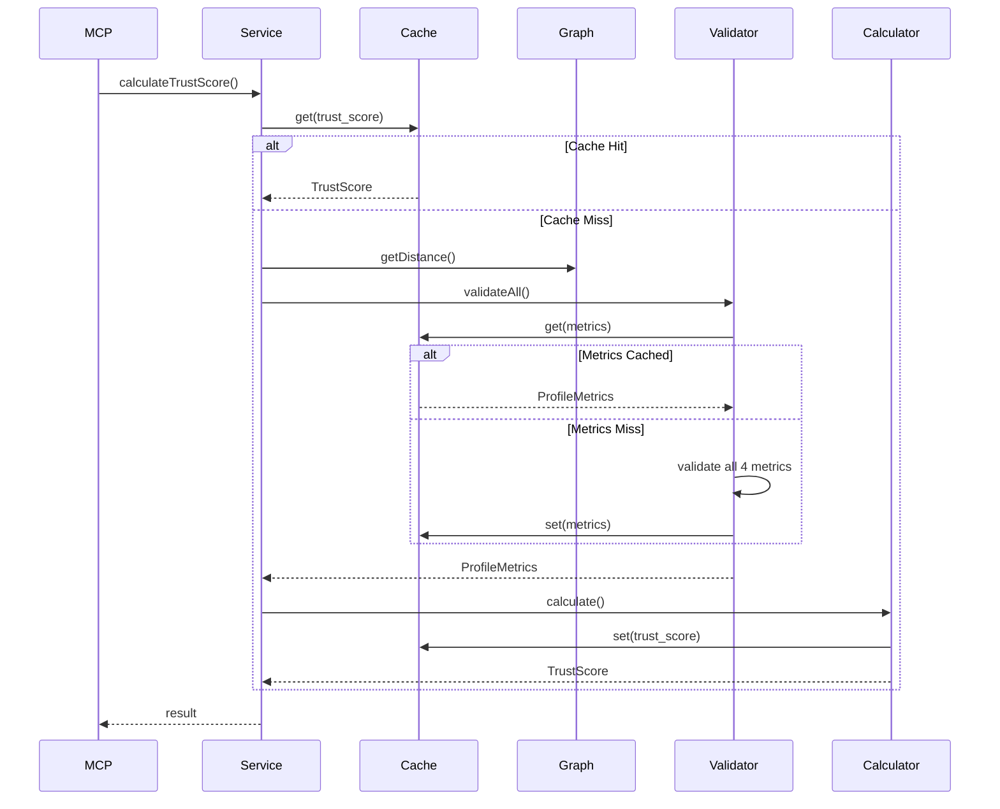
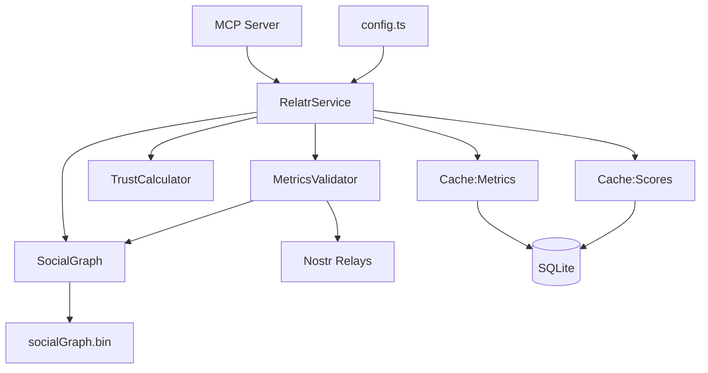

# Relatr v2 Architecture Specification

## Overview

Simplified Relatr implementation reducing complexity by 40-50% while maintaining 100% functional compatibility.

**Simplifications:**
- 6 database tables → 2 tables
- 4 validator classes → 1 class
- Dual caching → DB-only caching
- 6 weighting schemes → 4 simple presets
- ~6,500 lines → ~2,500 lines

---

## 1. Directory Structure

```
src/v2/
├── config.ts                    # Environment configuration (~80 lines)
├── types.ts                     # All type definitions (~120 lines)
├── database/
│   ├── connection.ts           # DB connection & setup (~60 lines)
│   ├── schema.sql              # 2-table schema (~40 lines)
│   └── cache.ts                # Generic cache (~100 lines)
├── validators/
│   └── MetricsValidator.ts     # All 4 validations (~250 lines)
├── graph/
│   └── SocialGraph.ts          # Graph operations (~200 lines)
├── trust/
│   └── TrustCalculator.ts      # Score calculation (~180 lines)
├── service/
│   └── RelatrService.ts        # Main orchestrator (~150 lines)
└── mcp/
    └── server.ts               # MCP interface (~120 lines)
```

---

## 2. Database Schema

### schema.sql

```sql
-- Enable SQLite optimizations
PRAGMA foreign_keys = ON;
PRAGMA journal_mode = WAL;
PRAGMA synchronous = NORMAL;

-- Table 1: Profile Metrics Cache
CREATE TABLE IF NOT EXISTS profile_metrics (
    pubkey TEXT PRIMARY KEY,
    nip05_valid REAL NOT NULL DEFAULT 0.0 CHECK(nip05_valid IN (0.0, 1.0)),
    lightning_address REAL NOT NULL DEFAULT 0.0 CHECK(lightning_address IN (0.0, 1.0)),
    event_kind_10002 REAL NOT NULL DEFAULT 0.0 CHECK(event_kind_10002 IN (0.0, 1.0)),
    reciprocity REAL NOT NULL DEFAULT 0.0 CHECK(reciprocity IN (0.0, 1.0)),
    computed_at INTEGER NOT NULL,
    expires_at INTEGER NOT NULL
);

CREATE INDEX idx_profile_metrics_expires ON profile_metrics(expires_at);

-- Table 2: Trust Scores Cache
CREATE TABLE IF NOT EXISTS trust_scores (
    source_pubkey TEXT NOT NULL,
    target_pubkey TEXT NOT NULL,
    score REAL NOT NULL CHECK(score >= 0.0 AND score <= 1.0),
    distance_weight REAL NOT NULL,
    nip05_weight REAL NOT NULL,
    lightning_weight REAL NOT NULL,
    event_weight REAL NOT NULL,
    reciprocity_weight REAL NOT NULL,
    computed_at INTEGER NOT NULL,
    expires_at INTEGER NOT NULL,
    PRIMARY KEY (source_pubkey, target_pubkey)
);

CREATE INDEX idx_trust_scores_expires ON trust_scores(expires_at);
CREATE INDEX idx_trust_scores_source ON trust_scores(source_pubkey);
```

---

## 3. Core Types

### types.ts

```typescript
// Configuration
export interface RelatrConfig {
    defaultSourcePubkey: string;
    graphBinaryPath: string;
    databasePath: string;
    nostrRelays: string[];
    decayFactor: number;
    cacheTtlSeconds: number;
    weights: MetricWeights;
}

export interface MetricWeights {
    distanceWeight: number;
    nip05Valid: number;
    lightningAddress: number;
    eventKind10002: number;
    reciprocity: number;
}

// Data types
export interface ProfileMetrics {
    pubkey: string;
    nip05Valid: number;
    lightningAddress: number;
    eventKind10002: number;
    reciprocity: number;
    computedAt: number;
    expiresAt: number;
}

export interface TrustScore {
    sourcePubkey: string;
    targetPubkey: string;
    score: number;
    components: ScoreComponents;
    computedAt: number;
}

export interface ScoreComponents {
    distanceWeight: number;
    nip05Valid: number;
    lightningAddress: number;
    eventKind10002: number;
    reciprocity: number;
    socialDistance: number;
    normalizedDistance: number;
}

// MCP types
export interface CalculateTrustScoreParams {
    sourcePubkey?: string;
    targetPubkey: string;
    weightingScheme?: 'default' | 'conservative' | 'progressive' | 'balanced';
    customWeights?: Partial<MetricWeights>;
}

export interface CalculateTrustScoreResult {
    trustScore: TrustScore;
    cached: boolean;
    computationTimeMs: number;
}

export interface HealthCheckResult {
    status: 'healthy' | 'unhealthy';
    database: boolean;
    socialGraph: boolean;
    timestamp: number;
}

export interface ManageCacheResult {
    success: boolean;
    metricsCleared?: number;
    scoresCleared?: number;
    message: string;
}
```

---

## 4. Component Specifications

### config.ts

```typescript
export function loadConfig(): RelatrConfig;
export function getDefaultWeights(): MetricWeights;
export function mergeWeights(defaults: MetricWeights, custom?: Partial<MetricWeights>): MetricWeights;
```

**Environment Variables:**
- `DEFAULT_SOURCE_PUBKEY` (required)
- `GRAPH_BINARY_PATH` (required)
- `NOSTR_RELAYS` (required, comma-separated)
- `DATABASE_PATH` (default: `./data/relatr.db`)
- `DECAY_FACTOR` (default: `0.1`)
- `CACHE_TTL_SECONDS` (default: `3600`)
- `WEIGHT_DISTANCE`, `WEIGHT_NIP05`, etc. (optional overrides)

### database/connection.ts

```typescript
export function initDatabase(path: string): Database;
export function closeDatabase(db: Database): void;
export function cleanupExpiredCache(db: Database): { metricsDeleted: number; scoresDeleted: number };
```

### database/cache.ts

```typescript
export class SimpleCache<T> {
    constructor(db: Database, tableName: string, ttlSeconds: number);
    
    async get(key: string | [string, string]): Promise<T | null>;
    async set(key: string | [string, string], value: T): Promise<void>;
    async clear(key?: string | [string, string]): Promise<number>;
    async cleanup(): Promise<number>;
}
```

### validators/MetricsValidator.ts

```typescript
export class MetricsValidator {
    constructor(nostrRelays: string[], graphManager: SocialGraph, cache: SimpleCache<ProfileMetrics>);
    
    async validateAll(pubkey: string, sourcePubkey?: string): Promise<ProfileMetrics>;
    
    // Individual validations (private/internal)
    async validateNip05(nip05: string, pubkey: string): Promise<number>;
    async validateLightning(profile: NostrProfile): Promise<number>;
    async validateEvent(pubkey: string): Promise<number>;
    async validateReciprocity(sourcePubkey: string, targetPubkey: string): Promise<number>;
}
```

### graph/SocialGraph.ts

```typescript
export class SocialGraph {
    constructor(binaryPath: string);
    
    async initialize(): Promise<void>;
    getDistance(targetPubkey: string): number;
    async switchRoot(newRoot: string): Promise<void>;
    doesFollow(source: string, target: string): boolean;
    isInitialized(): boolean;
    getCurrentRoot(): string;
}
```

### trust/TrustCalculator.ts

```typescript
export class TrustCalculator {
    constructor(config: RelatrConfig, cache: SimpleCache<TrustScore>);
    
    async calculate(
        sourcePubkey: string,
        targetPubkey: string,
        metrics: ProfileMetrics,
        distance: number,
        weights?: Partial<MetricWeights>
    ): Promise<TrustScore>;
    
    normalizeDistance(distance: number): number; // e^(-α × distance)
}
```

**Formula:** `Score = Σ(wᵢ × vᵢ) / Σ(wᵢ)`

### service/RelatrService.ts

```typescript
export class RelatrService {
    constructor(config: RelatrConfig);
    
    async initialize(): Promise<void>;
    async calculateTrustScore(params: CalculateTrustScoreParams): Promise<TrustScore>;
    async healthCheck(): Promise<HealthCheckResult>;
    async manageCache(action: 'clear' | 'cleanup' | 'stats', targetPubkey?: string): Promise<ManageCacheResult>;
    async shutdown(): Promise<void>;
}
```

### mcp/server.ts

```typescript
export async function startMCPServer(): Promise<void>;
```

**3 MCP Tools:**
1. `calculate_trust_score` - Main functionality
2. `health_check` - System status
3. `manage_cache` - Cache operations

---

## 5. Data Flow

### Trust Score Calculation Sequence



### Component Dependencies



---

## 6. Configuration

### Weighting Presets

```typescript
const PRESETS = {
    default: {
        distanceWeight: 0.5,
        nip05Valid: 0.15,
        lightningAddress: 0.1,
        eventKind10002: 0.1,
        reciprocity: 0.15
    },
    conservative: {
        distanceWeight: 0.3,
        nip05Valid: 0.25,
        lightningAddress: 0.15,
        eventKind10002: 0.15,
        reciprocity: 0.15
    },
    progressive: {
        distanceWeight: 0.6,
        nip05Valid: 0.1,
        lightningAddress: 0.1,
        eventKind10002: 0.1,
        reciprocity: 0.1
    },
    balanced: {
        distanceWeight: 0.4,
        nip05Valid: 0.2,
        lightningAddress: 0.1,
        eventKind10002: 0.1,
        reciprocity: 0.2
    }
};
```

---

## 7. Implementation Checklist

### Phase 1: Foundation
- [ ] Create `src/v2/` directory structure
- [ ] Implement `config.ts`
- [ ] Implement `types.ts`
- [ ] Create `database/schema.sql`
- [ ] Implement `database/connection.ts`
- [ ] Implement `database/cache.ts`

### Phase 2: Core Logic
- [ ] Implement `graph/SocialGraph.ts`
- [ ] Implement `trust/TrustCalculator.ts`
- [ ] Test distance normalization formula
- [ ] Test trust score calculation

### Phase 3: Validators
- [ ] Implement `validators/MetricsValidator.ts`
- [ ] Implement NIP-05 validation
- [ ] Implement Lightning validation
- [ ] Implement Event validation (kind 10002)
- [ ] Implement Reciprocity validation

### Phase 4: Service & MCP
- [ ] Implement `service/RelatrService.ts`
- [ ] Implement `mcp/server.ts`
- [ ] Register 3 MCP tools
- [ ] Integration testing
- [ ] Documentation

---

## 8. Key Formulas

### Distance Normalization
```
normalized = e^(-α × distance)

Where:
- α = 0.1 (decay factor)
- distance = social graph hops
- Special: distance = 1000 → normalized = 0.0 (unreachable)
```

### Trust Score
```
Score = Σ(wᵢ × vᵢ) / Σ(wᵢ)

Where:
- wᵢ = weight for metric i
- vᵢ = normalized value [0,1]
- Sum over 5 metrics: distance, nip05, lightning, event, reciprocity
```

---

## 9. Migration Strategy

Write all code fresh in the `src/v2/` directory. No migration from v1 needed.

---

**Status:** DRAFT - Ready for Implementation  
**Last Updated:** 2025-10-18