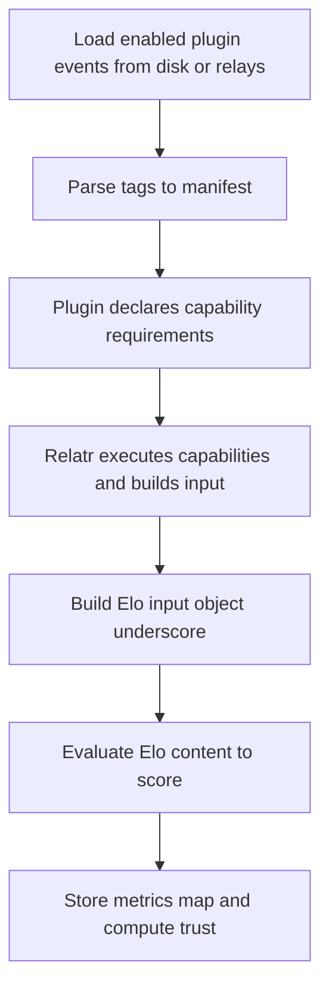

# Relatr Elo Validation Plugins (Portable, Events-First) — Design Plan

This document describes an evolution of Relatr's validation plugin system (today implemented in TypeScript in [`src/validators/plugins.ts`](src/validators/plugins.ts)) into a **portable**, **shareable**, and **deterministic** plugin format using **Elo** as a pure expression language.

The goal is to keep the current trust algorithm intact (weighted composition + social distance), while enabling Relatr operators to **import plugins from the filesystem** or **package/distribute them as Nostr events**.

---

## 1. Current State (What We're Preserving)

### 1.1 Validator outputs today

Each validation plugin returns a single scalar score in `[0, 1]` via [`ValidationPlugin.validate()`](src/validators/plugins.ts:29). The registry executes plugins and builds a map of results in [`ValidationRegistry.executeAll()`](src/validators/plugins.ts:54).

### 1.2 Trust score composition today

Relatr computes a final trust score via a weighted sum (distance + validator metrics) in [`TrustCalculator.calculate()`](src/trust/TrustCalculator.ts:42), implemented by [`calculateWeightedScore()`](src/trust/TrustCalculator.ts:132).

**Design constraint:** Elo plugins must continue to provide the _same shape_ of inputs to the trust calculator: `metrics.metrics` remains a mapping from metric keys to `[0,1]` values in [`ProfileMetrics`](src/types.ts:45).

---

## 2. Core Decisions (Approved Direction)

### 2.1 Elo is pure (no IO)

Elo scripts act as deterministic scoring kernels: they accept an input object `_` and return a numeric score in `[0,1]`.

All IO and data acquisition is performed by Relatr, not the Elo program.

### 2.2 Runtime output is minimal

At runtime, Elo returns **score only**. Plugin metadata (name, description, default weight, required inputs) lives in the plugin package.

### 2.3 Plugins are packaged as signed Nostr events

Plugins are represented as **one signed Nostr event**:

- `content`: Elo program text
- `tags`: manifest metadata

This event can be:

- stored on disk as JSON (filesystem import, test fixtures)
- fetched from relays
- cached locally to avoid repeated relay fetches

### 2.4 Canonical metadata comes from the signed event

The tags inside the signed event are authoritative for:

- plugin name
- description
- defaultWeight
- declared requirements

Operators may override **weight** in local config, but not rewrite metadata.

### 2.5 Identity uses event id (content-addressed)

Plugin identity is the **Nostr event id** (collision-free and immutable).

Relatr may also use a **stable metric key** derived from a tag (e.g. a slug), but the underlying identity is always the event id.

### 2.6 Events-first input model via capabilities

Relatr provides plugins with access to **raw Nostr events** through the `nostr.query` capability, rather than only precomputed facts.

Plugins can derive novel metrics without requiring changes to Relatr.

**Bounding requirement:** capability queries return up to **1000 events**.

---

## 3. Why Events-First (vs facts-first)

### Benefits

- **Flexibility:** plugin authors can compute metrics based on reactions, zaps, replies, reposts, etc.
- **Portability:** behavior is anchored in Nostr data shapes, not host-specific fact definitions.
- **Composable analysis:** plugins can compute statistics over event sets (counts, ratios, distributions) and map them to `[0,1]`.

### Trade-offs and mitigations

- **Conflicting events exist** (multiple kind 0, multiple kind 10002, etc.).
  - Mitigation: Relatr provides deterministic ordering and bounds; plugins can select their preferred strategy.
- **More computation cost in plugins**.
  - Mitigation: enforce CPU/memory/time limits; bound event sets; encourage "cheap first" plugin patterns.

---

## 4. Plugin Manifest Schema (in Nostr event tags)

The manifest should be represented entirely as tags, enabling signature coverage.

Tag names (locked):

- `name`: **stable slug / metric key** (machine-oriented)
- `title`: **human-readable display name**

Suggested tag set (extendable, but minimal for v1):

- `name`: stable slug / metric key
- `title`: human-readable name
- `about`: short description
- `weight`: defaultWeight (float)

Notes:

- Keep the schema minimal to avoid ecosystem fragmentation.
- Prefer allowing plugins to declare _data requirements_, not _fetch strategies_.

### 4.1 Requirements are declared by the plugin

The plugin manifest is the contract: it declares what it needs and Relatr provides it.

This implies a split of responsibilities:

- **Plugin declares** required kinds and limits.
- **Relatr provides** a small, stable "framework surface":
  - deterministic event bundle construction
  - normalization (sorting, verification status, bounds)
  - a standard input shape `_`

The plugin should never encode "fetch from relay X" or "use algorithm Y". It should only describe the data it needs to compute a score.

---

## 5. Normalized Elo Input Shape (`_`)

Relatr provides a standard input object to Elo.

### 5.0 Relatr as a small framework of primitives

From a plugin author perspective, Relatr should feel like a tiny framework where:

- the **only** program you ship is Elo (pure)
- Relatr gives you stable primitives via `_` (events + context)
- additional convenience primitives can be added as backward-compatible extensions of `_`

This keeps plugins portable while still letting Relatr evolve its host-side capabilities.

### 5.1 Required baseline fields

- `pubkey`: target
- `sourcePubkey`: optional; for reciprocity-like metrics
- `now`: unix seconds
- `cap`: capability results namespace

### 5.2 Event normalization rules (determinism)

Relatr must ensure that events returned by capabilities are deterministic enough to be portable:

- Events are signature-verified, or Relatr includes a `verified` boolean per event wrapper.
- Events are **sorted deterministically**:
  - primary: `created_at` descending
  - tie-break: `id` lexicographic ascending
- Events are bounded: up to 1000 per query (enforced by capability)

### 5.3 Why 1000 is reasonable (and what to watch)

1000 enables meaningful set analysis (reactions, zaps, etc.) while remaining bounded.

Key operational insights:

- The 1000 limit is enforced per capability invocation
- Plugins can request fewer events via filter limit if needed
- This prevents unbounded IO while allowing flexible queries

---

## 6. Weights and Maintaining the Current Algorithm

### 6.1 Plugin defaultWeight

Each plugin declares `defaultWeight` in its signed metadata.

### 6.2 Operator override

Operators override weights in config while preserving:

- same weighted formula
- same distance weight

This keeps behavior aligned with [`TrustCalculator`](src/trust/TrustCalculator.ts:42).

---

## 7. Execution Flow (High-Level)

The execution remains similar to today's [`MetricsValidator.validateAll()`](src/validators/MetricsValidator.ts:104), but with an Elo plugin loader and a data provisioning phase.



---

## 8. Storage and Caching

### 8.1 Plugin definition storage

- Plugins can be stored on disk as JSON Nostr events.
- Relatr may also cache fetched plugin events on disk.

### 8.2 Metrics caching

Maintain a simple, operationally friendly caching approach:

- **Upsert on compute:** whenever a trust rank / metrics set is computed for a `(pubkey, sourcePubkey?, searchQuery?, plugin-set)` context, metrics are upserted.
- **Staleness-based recompute:** metrics are recomputed when they are stale (age-based, or when plugin inputs have changed materially).
- **Garbage collection:** orphan metrics (e.g. from removed plugins or old plugin-set ids) can be cleaned periodically.

This keeps runtime behavior stable and avoids complex invalidation fanout.

#### 8.2.1 Suggested staleness keys

To keep this deterministic and debuggable, staleness should be computed from explicit keys:

- `pluginSetId`: hash of enabled plugin event ids + operator weight overrides
- `computedAt`
- `maxAgeSeconds`

Relatr can treat metrics as stale if `now - computedAt > maxAgeSeconds`, or if the `pluginSetId` changes.

---

## 9. Security and Resource Controls (Non-negotiable even with curated plugins)

Even with curated/reputable plugins, accidental worst-cases happen.

Minimum controls:

- timeouts per plugin evaluation
- memory limits / maximum input size
- timeouts per capability invocation (5s)
- max events per capability query (1000)
- verify events (or at least mark verification status)

These preserve instance stability without compromising ecosystem flexibility.

---

## 10. Extensible Host Capabilities (When a Plugin Needs External IO)

This section extends the core design without breaking its main constraint: **Elo remains pure and deterministic over its provided input**.

### 10.1 The pattern: capability-based provisioning

Plugins do not perform IO. Instead, they **declare capabilities** they need. Relatr acts as a small framework that:

1. reads the plugin manifest (tags)
2. plans a provisioning step based on declared needs
3. fetches/computes required data using host code
4. injects results into the Elo input object (`_`)
5. runs Elo to compute the final score

This keeps portability and determinism while still allowing richer metrics.

### 10.2 Capability declarations as tags

Plugins declare host capabilities using `cap` and `cap_arg` tags.

Suggested tag families (names illustrative; keep schema small and extendable):

- `cap`: requests a named host capability
- `cap_arg`: provides arguments for the capability (repeatable)

Example (conceptual):

- `cap`: `graph.mutual_follows`
- `cap_arg`: `source=_.sourcePubkey`
- `cap_arg`: `target=_.pubkey`

Important constraints:

- Capabilities are **namespaced** (`nostr.*`, `graph.*`, `http.*`) to avoid collisions.
- Capabilities should be **pure functions of declared inputs** wherever possible (same request, same output for a given snapshot).
- Relatr may refuse a capability request if the operator has not enabled it via environment config.

#### 10.2.1 Capability catalog: keep v1 small

To keep v1 simple (while still covering today's needs), lock a minimal catalog:

- `nostr.query` -> `[nostr-event]` (accepts any nostr filter, returns bounded events)
- `graph.stats` -> `{ totalFollows: number, uniqueFollowers: number, uniqueFollowed: number }`
- `graph.all_pubkeys` -> `[string]` (all unique pubkeys in graph)
- `graph.pubkey_exists` -> boolean
- `graph.is_following` -> boolean (followerPubkey, followedPubkey)
- `graph.are_mutual` -> boolean (pubkey1, pubkey2)
- `graph.degree` -> `{ outDegree: number, inDegree: number }`
- `http.nip05_resolve` -> `{ pubkey: string | null }`

Capability control:

- Each capability declares its default enabled/disabled state
- Operators override via environment variables (e.g., `ENABLE_CAP_NOSTR_QUERY=false` to disable, or `ENABLE_CAP_NOSTR_QUERY=true` to enable if default is disabled)

### 10.3 Where capability results appear in `_`

To avoid breaking changes, capability outputs should live under a reserved namespace such as:

- `_.cap` (capability results)

Example shape:

```text
{
  pubkey: <hex>,
  now: <int>,
  events: { ... },
  cap: {
    graph: {
      mutual_follows: true
    },
    http: {
      fetch: {
        status: 200,
        json: { ... }
      }
    }
  }
}
```

### 10.4 Determinism rules for capabilities

Some capabilities are intrinsically time-varying or depend on network IO. The system stays consistent with the current design by making the _host_ responsible for determinism boundaries.

Rules:

1. **Caching rule:** capability results are cached by `(plugin event id, target pubkey, capability name, args)`.
2. **Timeout rule:** each capability has a strict timeout and failure mode that maps to safe defaults (typically absence or null, which Elo can map to score `0.0`).
3. **Operator policy rule:** operators enable/disable capabilities and can configure allowlists (especially for `http.*`).

#### 10.4.1 Failure semantics (host side)

Capabilities should fail closed and produce values that Elo can handle predictably:

- return `null` or a minimal empty structure on timeout/error
- never throw into Elo evaluation
- allow Elo to map missing data to `0.0`

This mirrors what you already do in TS plugins today: timeouts and safe defaults (see [`ValidationRegistry.executeAll()`](src/validators/plugins.ts:54)).

### 10.5 Example capabilities (mapping to today's TS validators)

#### A) Graph computation: mutual follows (port of [`ReciprocityPlugin.validate()`](src/validators/plugins.ts:230))

- Capability: `graph.are_mutual`
- Inputs: `pubkey1`, `pubkey2`
- Output: boolean

Elo becomes trivial:

```text
if fetch(_.cap, .graph.are_mutual) == true then 1.0 else 0.0
```

#### B) Nostr query: flexible event fetching

- Capability: `nostr.query`
- Inputs: `filter` (JSON string containing nostr filter)
- Output: array of nostr events (max 1000, deterministically sorted)

Elo can process any query:

```text
let reactions = fetch(_.cap, .nostr.query) | [] in
count(reactions) / 100.0
```

#### C) HTTP fetch: NIP-05 resolution (port of [`Nip05Plugin.validate()`](src/validators/plugins.ts:79))

- Capability: `http.nip05_resolve`
- Inputs: `nip05` string
- Output: resolved pubkey (or null)

Elo can then score:

```text
let resolved = fetch(_.cap, .http.nip05_resolve.pubkey) | null in
if resolved == _.pubkey then 1.0 else 0.0
```

### 10.6 Why capabilities are better than allowing IO inside Elo

- Keeps plugin runtime portable (Elo remains a pure expression).
- Keeps operator control centralized (rate limits, allowlists, caching, timeouts).
- Keeps the ecosystem evolvable: new capabilities can be added without changing old plugins.

---

## 11. Migration Plan (Incremental)

1. Keep existing TS plugins and registry as-is (compatibility).
2. Introduce Elo plugin loader + evaluator and run Elo plugins in parallel with existing plugins.
3. Map existing validators to Elo equivalents where possible:
   - pure checks like root NIP-05 can migrate quickly
   - IO-heavy checks (NIP-05 resolution) remain in host provisioning initially
4. Switch defaults gradually once parity is proven.

---

## 12. Open Items to Finalize (Before Implementation)

1. Tag schema finalization (exact tag names and required/optional fields).
2. Event normalization details:
   - whether to merge or simply provide lists
   - how to represent verification status
3. Exact mapping from plugin identity (event id) to `metrics.metrics` key(s).
4. Cache invalidation trigger definition (file change detection vs explicit reload).
5. Capability catalog definition (names, input args schema, output schema) and operator policy defaults.

### 12.1 Implementation-ready decisions (locked)

To reduce ambiguity during implementation, the following are now considered locked:

- Plugin tag keys:
  - `name` = stable slug / metric key
  - `title` = human-readable display name
  - `about` = short description
  - `weight` = defaultWeight
- Capability request tags:
  - `cap` and `cap_arg`
- Capability output namespace in input: `_.cap`
- V1 capability catalog:
  - `nostr.query` -> `[nostr-event]` (filter-based, max 1000 events)
  - `graph.stats` -> `{ totalFollows, uniqueFollowers, uniqueFollowed }`
  - `graph.all_pubkeys` -> `[string]`
  - `graph.pubkey_exists` -> boolean
  - `graph.is_following` -> boolean
  - `graph.are_mutual` -> boolean
  - `graph.degree` -> `{ outDegree, inDegree }`
  - `http.nip05_resolve` -> `{ pubkey: string | null }`
- Capability policy: Operators enable/disable via environment config (e.g., `ENABLE_CAP_NOSTR_QUERY`)
- Resource limits: Max 1000 events per query, 5s timeout per capability
- Metrics caching: upsert on compute; recompute when stale; periodic orphan cleanup
- Caching: Simple cache without graph snapshot IDs (occasional staleness acceptable)
