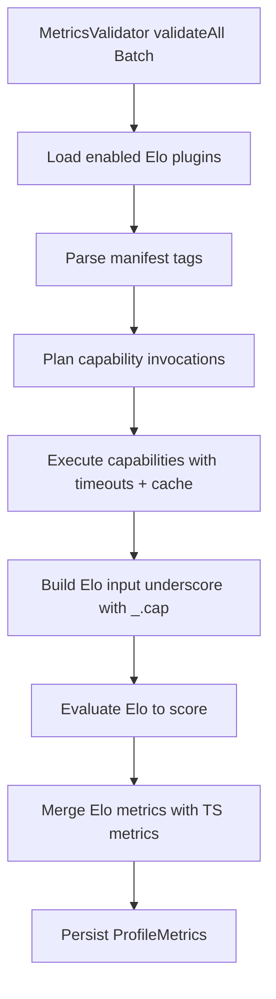

# Relatr Elo Portable Plugins — Implementation Plan

This document translates the design in [`plans/elo-plugins-design.md`](plans/elo-plugins-design.md) and the overview in [`plans/portable-plugins-overview.md`](plans/portable-plugins-overview.md) into an implementation-ready blueprint.

It focuses on:

- concrete integration points in the current codebase
- proposed new components/modules
- data models and schemas
- execution flow, determinism rules, and failure semantics
- configuration surface and security/resource controls
- an actionable implementation checklist

Reference on Elo runtime/JS integration is captured in [`plans/elo-docs.md`](plans/elo-docs.md).

---

## 1. Scope and non-goals

### In scope (v1)

- Load Elo plugins from **local filesystem JSON** (each plugin is a signed Nostr event object).
- Optional dev/test mode: load **unsafe plugin templates** (JSON missing signature, and optionally missing id) when explicitly enabled by env.
- Parse plugin manifest **from event tags**.
- Provision plugin inputs via a **capability engine** (`nostr.query`, `graph.*`, `http.nip05_resolve`).
- Evaluate Elo using `@enspirit/elo` `compile()` with a controlled runtime.
- Return only **score** per plugin and integrate scores into existing trust calculation pipeline.
- Keep caching operationally simple: staleness-based metrics caching + per-capability caching.

### Explicit non-goals (v1)

- Fetch plugins from relays (distribution). The runtime should _support it later_ via an adapter.
- Plugin pack formats, curated pack publishing, signatures beyond the event signature itself.
- Operator UX/UI (though config should be structured so UI can be built later).

---

## 1.1 Unsafe plugin templates (dev/test only)

For debugging and rapid iteration it is useful to allow "plugin templates" that are shaped like Nostr events but are not fully signed.

Proposal:

- Add an environment toggle: `ELO_PLUGINS_ALLOW_UNSAFE=true`.
- When enabled, the loader accepts plugin JSON where:
  - `sig` is missing, and
  - `id` may be missing.
  - `pubkey` may be missing.

Identity and safety rules (important):

- Unsafe plugins must get a **local-only identity**, derived deterministically so caching and debugging works.
  - Recommended: `unsafeId = sha256(kind + pubkey? + id? + created_at + tags + content)`.
- Unsafe plugins must be flagged `unsafe=true` in the parsed representation.
- Unsafe plugins must never be treated as cacheable “fetched plugin events” (avoid poisoning a real plugin cache once relay fetching is added).
- Unsafe mode should be noisy in logs, and should be off by default.

---

## 2. Where this plugs into the existing code

### 2.1 Current trust pipeline

`RelatrService.calculateTrustScoresBatch()` orchestrates the two primary inputs:

- social distances from graph
- metrics (validators) from `MetricsValidator`

See [`src/service/RelatrService.ts`](src/service/RelatrService.ts:75).

### 2.2 Current metrics pipeline

`MetricsValidator.validateAll()` and `validateAllBatch()`:

- fetch metadata (kind 0) via `MetadataRepository` and relay fallback
- run current TS validators via `ValidationRegistry.executeAll()`
- write metrics to `MetricsRepository`

See [`src/validators/MetricsValidator.ts`](src/validators/MetricsValidator.ts:104).

### 2.3 Implementation strategy for minimal disruption

Add Elo plugins as an additional metrics source _inside_ `MetricsValidator`:

- Keep `ValidationRegistry` for TS plugins intact.
- Introduce an `EloPluginRegistry`/`EloPluginRunner` that produces `Record<string, number>`.
- Merge the maps: `{...tsMetrics, ...eloMetrics}` with deterministic conflict handling.

Decision to lock for v1:

- **Metric key** used in `ProfileMetrics.metrics` should be the plugin `name` tag (stable slug), consistent with docs.
- If a TS plugin and Elo plugin share the same key, prefer operator-configured ordering or “Elo overrides TS” only if explicitly enabled.

---

## 3. New components to add

This section defines the components and their responsibilities. The precise filenames can be chosen during implementation; the important part is the module boundaries.

### 3.1 Plugin loading

**Goal:** produce a set of `PortablePlugin` objects from a directory.

Responsibilities:

- Read plugin JSON files from a configured directory.
- Parse into a typed `NostrEvent`-like structure.
- Validate minimal invariants: `id`, `pubkey`, `created_at`, `kind`, `tags`, `content`.
- Extract manifest fields and capability requests.

Proposed module:

- [`src/plugins/PortablePluginLoader.ts`](src/plugins/PortablePluginLoader.ts:1)

### 3.2 Manifest parsing

**Goal:** convert `tags: string[][]` into a structured manifest.

Tag schema (locked):

- `name`, `title`, `about`, `weight`
- repeatable `cap`
- repeatable `cap_arg`

Important nuance:

- `cap_arg` must be associated with a specific `cap` occurrence.
  - simplest v1 approach: interpret tags sequentially and attach subsequent `cap_arg` entries to the most recent `cap`.
  - this enables multiple `nostr.query` invocations with different filters.

Proposed module:

- [`src/plugins/PluginManifest.ts`](src/plugins/PluginManifest.ts:1)
- [`src/plugins/parseManifestTags.ts`](src/plugins/parseManifestTags.ts:1)

### 3.3 Capability engine

**Goal:** execute declared capabilities and return results that will be injected into `_.cap`.

Capabilities (v1 catalog):

- `nostr.query(filter)` -> `[nostr-event]` (bounded to 1000; deterministic sort)
- `graph.stats()` -> `{ totalFollows, uniqueFollowers, uniqueFollowed }`
- `graph.all_pubkeys()` -> `[string]`
- `graph.pubkey_exists(pubkey)` -> `bool`
- `graph.is_following(followerPubkey, followedPubkey)` -> `bool`
- `graph.are_mutual(pubkey1, pubkey2)` -> `bool`
- `graph.degree(pubkey)` -> `{ outDegree, inDegree }`
- `http.nip05_resolve(nip05)` -> `{ pubkey: string | null }`

Execution requirements:

- every call has a timeout (default 5s)
- failures return safe defaults (`null`/empty list/false) and never throw into Elo evaluation
- per-invocation event bound (1000)
- deterministic sorting for event outputs

Integration dependencies:

- Nostr relay pool + relays list (`RelayPool`, `nostrRelays`) already exist in `MetricsValidator` context.
- Social graph operations are already on `SocialGraph` (`areMutualFollows()` etc.)
  - see [`src/validators/plugins.ts`](src/validators/plugins.ts:241).
- NIP-05 resolution already exists via `nostr-tools/nip05` and `withTimeout()`.

Proposed modules:

- [`src/capabilities/CapabilityRegistry.ts`](src/capabilities/CapabilityRegistry.ts:1)
- [`src/capabilities/CapabilityExecutor.ts`](src/capabilities/CapabilityExecutor.ts:1)
- [`src/capabilities/nostrQuery.ts`](src/capabilities/nostrQuery.ts:1)
- [`src/capabilities/httpNip05Resolve.ts`](src/capabilities/httpNip05Resolve.ts:1)
- [`src/capabilities/graphOps.ts`](src/capabilities/graphOps.ts:1)

### 3.4 Elo evaluation

**Goal:** compile Elo once per plugin, run it many times.

From [`plans/elo-docs.md`](plans/elo-docs.md):

- `compile(expr, { runtime })` returns a JS function that takes `_` input.
- Elo supports guards/type schemas, but they compile to JS/Ruby only; we can use guards in development and consider stripping later.

Implementation notes:

- Cache compiled functions per plugin event id (or per content hash).
- Provide runtime dependencies needed by Elo (if any). The Elo docs show optional `DateTime`/`Duration` from `luxon`.
  - v1 suggestion: do not expose host objects; keep runtime minimal.
  - if we need NOW/TODAY support, decide whether to provide `luxon` or to inject `now` as scalar as already specified.

Proposed module:

- [`src/plugins/EloEvaluator.ts`](src/plugins/EloEvaluator.ts:1)

### 3.5 Elo plugin runner

**Goal:** for a given `(pubkey, sourcePubkey?, searchQuery?)`, execute all enabled Elo plugins and return a metrics map.

Responsibilities:

- Create the Elo input object `_` with baseline fields:
  - `pubkey`, `sourcePubkey`, `now`, `cap`
- Plan and execute capabilities required by the plugin(s)
- Evaluate Elo content to a score
- Clamp score to `[0,1]` (defensive)
- Apply failure fallback = `0.0`

Proposed module:

- [`src/plugins/EloPluginRunner.ts`](src/plugins/EloPluginRunner.ts:1)

---

## 4. Data models and schemas

### 4.1 Plugin event JSON (filesystem)

Filesystem plugin artifacts are JSON with the same shape as a signed Nostr event.

Minimum required fields:

```text
{
  id: string,
  pubkey: string,
  created_at: number,
  kind: number,
  tags: string[][],
  content: string,
  sig: string
}
```

Notes:

- We should accept additional fields but ignore them.
- v1 can optionally skip signature verification on load (but should keep the door open to verifying).

### 4.2 Parsed manifest

```text
{
  name: string,
  title: string | null,
  about: string | null,
  weight: number | null,
  caps: [
    { name: string, args: string[] }
  ]
}
```

### 4.3 Capability request/response envelope

Even if individual capabilities differ, the executor should operate on a uniform internal representation:

```text
{
  capName: string,
  args: string[],
  timeoutMs: number,
  cacheKey: string
}
```

The response is:

```text
{
  ok: boolean,
  value: any,     // inserted into _.cap
  error: string | null,
  elapsedMs: number
}
```

---

## 5. Execution flow and determinism

### 5.1 Flow



### 5.2 Deterministic event ordering

For `nostr.query` outputs:

- primary sort: `created_at` descending
- tie-break: `id` ascending lexicographic

This should be applied after collecting events from relays and after bounding.

### 5.3 Failure semantics

- Capability failure never aborts plugin execution.
- Elo evaluation failure yields score `0.0`.
- Missing values should be represented as `null` or empty collections so Elo can use `|` fallback.

---

## 6. Caching strategy

### 6.1 Metrics caching (existing)

The existing `MetricsRepository` caching remains the primary cache. `MetricsValidator` already stores:

- `computedAt`
- `expiresAt`

See [`src/validators/MetricsValidator.ts`](src/validators/MetricsValidator.ts:148).

We will extend it conceptually by incorporating the **pluginSetId** into the cache key semantics:

- if enabled Elo plugin set changes, cached metrics still valid, ocassionall staleness is acceptable and expiration time controls staleness.

Implementation options:

1. store `pluginSetId` in `ProfileMetrics` (requires schema change)
2. keep existing DB schema and store pluginSetId in a separate table / KV entry
3. simplest v1: treat cache TTL as sufficient and accept transient staleness

Given the design direction (“simple cache, occasional staleness acceptable”), v1 can start with (3).

### 6.2 Capability caching

Capabilities should be cached by:

- plugin event id
- target pubkey
- capability name

Additionally, to support multiple invocations of the same capability with different `cap_arg` values (and to enable correct batching/deduplication), include a deterministic hash of the args:

- `capArgsHash = sha256(canonicalArgsString)`

Where `canonicalArgsString` is:

- the raw `cap_arg` strings in their declared order, joined by `\n`, and prefixed by the capability name (to avoid accidental collisions).

Notes:

- This approach avoids having to parse `cap_arg` structure in v1.
- It preserves correctness for “multiple `nostr.query` calls per plugin”.
- It also enables a future optimization where different plugins requesting the same capability with the same args can share one execution.

TTL:

- Capability cache TTL should be driven by the existing TTL configuration exposed via environment/config (keep one source of truth for staleness).

---

## 7. Configuration surface

### 7.1 New config fields

Extend [`src/config.ts`](src/config.ts:26) / `RelatrConfigSchema` with:

- `eloPluginsEnabled` (bool) default false
- `eloPluginsDir` (string) default `./plugins/elo`
- `eloPluginTimeoutMs` (number) default 50-200ms (tight), or align with current patterns
- `capTimeoutMs` (number) default 5000

Additional env flags:

- `ELO_PLUGINS_ALLOW_UNSAFE` (bool) default false

Capability toggles (env):

- `ENABLE_CAP_NOSTR_QUERY`
- `ENABLE_CAP_GRAPH_STATS`
- `ENABLE_CAP_GRAPH_ALL_PUBKEYS`
- ...
- `ENABLE_CAP_HTTP_NIP05_RESOLVE`

Decision: keep these booleans in env rather than config file to match current operational style.

### 7.2 Default enablement

Each capability defines its own default enable/disable state; env vars override.

---

## 8. Security and resource controls

Non-negotiable controls (aligning with design):

- hard timeouts on:
  - capability invocations (default 5s)
  - Elo evaluation per plugin
- max events per `nostr.query` invocation = 1000
- input size guardrails (avoid injecting huge blobs into `_`)
- ensure any HTTP capability is narrow and sanitized

Important: since plugin content is untrusted code (even if pure), treat it as potentially expensive.

Unsafe plugins:

- If `ELO_PLUGINS_ALLOW_UNSAFE=true`, treat loaded plugins as untrusted dev artifacts.

---

## 8.1 Unexpected performance improvement: planning + batching capabilities

The capability-based design enables a **planning step** that can significantly improve validation performance.

Current design already has a per-plugin plan:

- parse manifest tags
- plan capability invocations
- execute capabilities
- build `_` and evaluate Elo

Optimization: build a **global plan per validation run** (per target pubkey context) and batch complementary operations.

Conceptual approach:

1. For a given `(targetPubkey, sourcePubkey?, searchQuery?)`, collect capability requests across all enabled Elo plugins.
2. Group requests by:
   - capability name
   - args hash (`capArgsHash`)
3. Execute unique grouped requests concurrently (with a global concurrency limit per capability type).
4. Fan out results into each plugin’s `_.cap` namespace.

Why this helps:

- Reduces redundant relay queries when multiple plugins need overlapping event sets.
- Enables concurrency while maintaining deterministic outputs.
- Lowers total wall-clock time for the validation phase, especially in batch mode (`validateAllBatch`).

Design check:

- This is compatible with the current model because Elo remains pure and all IO happens in the host provisioning phase.
- The `capArgsHash` is the key enabler for correctness when deduplicating capability calls.

---

## 9. Phased integration checklist (actionable)

### Phase 1: plumbing (no behavior change)

- Add config fields for enabling Elo plugins and plugin directory.
- Create loader that reads plugin JSON from disk.
- Parse manifest tags and validate required fields.

### Phase 2: capabilities + single plugin execution

- Implement `nostr.query` capability using existing pool/relays.
- Implement minimal `graph.are_mutual` (or `graph.stats`) via `SocialGraph`.
- Implement `http.nip05_resolve` by reusing existing logic in [`Nip05Plugin.validate()`](src/validators/plugins.ts:79).
- Implement Elo evaluator using `@enspirit/elo` `compile()`.
- Do unit testing to determine if the approach stills feasible

### Phase 3: integrate with MetricsValidator

- In `MetricsValidator.validateAll()` and `validateAllBatch()`, when enabled:
  - compute Elo metrics
  - merge into metrics map
- Ensure errors yield `0.0` but do not break the rest of the metrics.

### Phase 4: hardening

- Add capability caching.
- Add compilation caching.
- Add limits and instrumentation (timings per capability/plugin).

---
