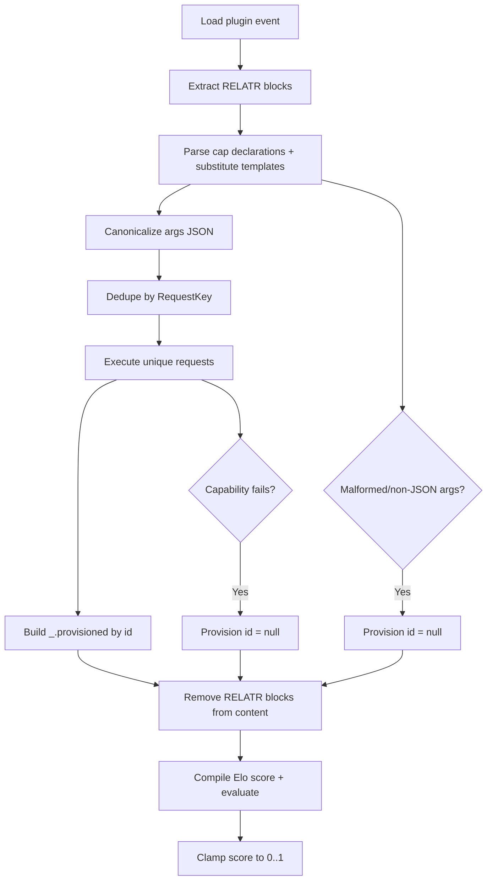

# Elo Portable Plugins — v0 Spec

This document defines the portable plugin format for Relatr Elo plugins.

## 1. Goals

- **Portable**: plugins can be shared and loaded across relatr instances.
- **Plannable**: the host can discover external data dependencies before scoring.
- **Performant**: pre-provisioning enables batching and deduplication of capability calls.
- **Robust**: failures are non-fatal; plugins default safely.

Non-goals (v0):

- Cross-evaluation caching of capability results
- A plugin-defined type system beyond the JSON-only constraint for `args_expr`

## 2. Publishing format (Nostr)

- **Event kind**: `765` (temporary)
- Plugin Elo code is stored in `content`
- Metadata is expressed via tags

### 2.1 Required tags

- `name`: `snake_case` or `kebab-case` identifier (lowercase `a-z0-9_-`)
- `relatr-version`: plugin protocol version understood by the host (for this spec: `v0`)

### 2.2 Optional tags

- `title`: human-friendly name
- `description`: short text description
- `weight`: numeric default weight

Notes:

- The `relatr-version` tag exists to keep plugins portable across Relatr instances.
  It versions the **RELATR planning protocol** (block markers, declaration syntax, args JSON rules,
  request key scheme), not the host's capability catalog.

## 3. Inputs (`_`)

Plugins receive all inputs via Elo’s standard input variable `_`.

Host-provided input schema:

- `_.targetPubkey`: string
- `_.sourcePubkey`: string | null
- `_.now`: integer **seconds** since Unix epoch

Notes:

- `_.now` is constant for a single evaluation run.
- Plugin authors should treat `_.sourcePubkey == null` as a normal case.

## 4. Capability boundary: RELATR blocks + plan-time Elo args

Plugins declare external dependencies using **RELATR blocks** embedded in the plugin `content` as Elo line-comments.

Inside a RELATR block, plugins can declare capability requests whose args are **Elo expressions evaluated at plan-time**.

This preserves full Elo expressiveness for both:

- the score expression (compiled and executed after provisioning)
- arguments to capability requests (computed deterministically before provisioning)

### 4.1 RELATR block markers

A RELATR block is delimited by two marker lines:

```text
--RELATR
... Relatr declarations ...
--RELATR
```

Notes:

- `--` is an Elo line comment, so this syntax is valid in the Nostr event `content`.
- The host MUST extract RELATR blocks and remove them from the source before compiling the Elo score expression.

### 4.2 Declaration format

Each declaration binds an id to one capability request:

```text
cap <id> = <capName> <args_expr>
```

Where:

- `<id>` is a lowercase `snake_case` or `kebab-case` identifier (`a-z0-9_-`), unique within the plugin.
- `<capName>` is a dotted capability name, e.g. `nostr.query`, `graph.are_mutual`, `http.nip05_resolve`.
- `<args_expr>` is an Elo expression, evaluated during planning.

Examples:

```text
--RELATR
cap meta = nostr.query {kinds: [0], authors: [_.targetPubkey], limit: 1}
cap mutual = graph.are_mutual {a: _.sourcePubkey, b: _.targetPubkey}
cap nip05 = http.nip05_resolve {nip05: 'alice@example.com'}
--RELATR
```

### 4.3 Plan-time environment

Capability args expressions are evaluated with access to:

- `_` (same input object as scoring)
- `_.planned: { [id: string]: <jsonOrNull> }` containing results of earlier declarations in the same plugin (in file order)

This enables multi-step planning pipelines (e.g. fetch metadata → derive args → call another capability).

### 4.4 Scoring-side lookup convention

During scoring, provisioned results are available by id:

- `_.provisioned: { [id: string]: <jsonOrNull> }`

Missing/failed/unplannable requests resolve to `null`.

## 5. Argument rules (JSON-only)

Each `<args_expr>` MUST evaluate to a **strict JSON value**, meaning only:

- null
- boolean
- number
- string
- tuple (JSON object)
- list (JSON array)

Disallowed in args (v0): any non-JSON Elo value (e.g. DateTime, Duration, Function).

If `<args_expr>` cannot be evaluated, or it evaluates to a non-JSON value, the request is treated as unplannable (see failures).

Recommended conventions:

- Prefer tuples for arguments (named fields) over lists (positional) unless the capability definition is inherently positional.
- Arguments should be deterministic functions of `_` (and `_.planned`) only.

Practical note (real-network determinism):

- If an `<args_expr>` depends on **relay-returned data** (e.g. `nostr.query` results), then the declaration can become unstable unless the upstream capability specifies deterministic ordering and you only depend on stable fields.
- If you need a second-stage request (e.g. `http.nip05_resolve`) and want it to be reliably plannable, prefer deriving its args from `_` (or a fixed constant) rather than from nondeterministic relay responses.

## 6. Execution model (plan-only)

Plugins are evaluated in two phases:

1. **Plan**: discover and precompute capability requests.
2. **Score**: evaluate Elo scoring logic using provisioned results.

This keeps policy/mechanism clean:

- Plugin code expresses scoring policy.
- The host owns mechanism: capability execution, timeouts, enablement, batching.

Important property:

- **All capability execution happens during provisioning**. Scoring is compute-only.

## 7. Planning & provisioning

### 7.1 Planning

For each plugin, the host:

1. Extracts RELATR blocks from plugin source.
2. Parses each `cap <id> = <capName> <args_expr>` declaration.
3. For each declaration (in source order):
   - Compiles and evaluates `<args_expr>` using Elo with plan-time input `_`.
   - Enforces JSON-only on the resulting value.
   - Canonicalizes the resulting args JSON to form a stable request key.

Request key:

- `RequestKey = capName + "\n" + canonicalArgsJson`

Canonicalization:

- `canonicalArgsJson` MUST be produced using a stable JSON canonicalization scheme (e.g. RFC 8785-style).
- Objects/tuples must canonicalize independent of key insertion order.

### 7.2 Deduplication

The host dedupes requests across all plugins by `RequestKey`.

Additionally:

- The host MAY collect per-plugin request attribution (for debugging/tracing) without affecting dedupe.

### 7.3 Provisioning

The host executes each unique request using the corresponding capability handler and stores:

- `provisionedByKey[RequestKey] = resultJsonOrNull`

Then, for scoring convenience:

- `provisionedById[id] = provisionedByKey[RequestKey]` (or `null`)

### 7.4 Scoring compilation

The host MUST compile and score Elo after removing RELATR blocks.

Recommended mechanism (v0):

- Host injects provisioned results via input `_` under:
  - `_.provisioned: { [id: string]: <jsonOrNull> }`

Implementation guidance:

- The Elo scoring expression SHOULD be pure stdlib-only Elo.
- It MUST be deterministic for a given `_` input and provisioned map.

Enablement and permissioning:

- The host MUST refuse to execute capabilities that are disabled.
- The host MUST refuse to execute capabilities that are unknown.
- The host SHOULD provide operator-configurable allow/deny policy for capability execution.

Timeouts and limits:

- The host MUST apply timeouts for capability execution.
- The host MAY apply rate limiting and batching policies.

## 8. Failure semantics

Failures are non-fatal. The host should log warnings.

### 8.1 Unplannable args

If a RELATR block declaration is malformed, args JSON cannot be parsed, template substitution fails, or args are non-JSON:

- The request is not executed.
- The corresponding `_.provisioned.<id>` value is `null` during scoring.

This is achieved by injecting `null` for the provisioned id.

### 8.2 Capability failures

If a capability is disabled, unknown, times out, or errors:

- Store `null` for that request.
- The corresponding provisioned id resolves to `null`.

### 8.3 Scoring convention

Plugin authors should treat `null` as a safe negative signal and return a score of `0.0`.

## 9. Inspectability (recommended)

For debugging and operational transparency, the host SHOULD be able to expose:

- Planned request set per plugin: list of `(capName, canonicalArgsJson, RequestKey)`
- Planned id map per plugin: `(id -> RequestKey)`
- Deduped provisioning set: list of `RequestKey`
- Provisioning outcomes: `RequestKey -> ok | null | error` (without requiring plugins to depend on this)

This is intentionally "Unix-like": you can observe what the system will do without changing plugin semantics.

## 10. Examples

### 10.1 Nostr query

Determinism requirement:

- The `nostr.query` capability MUST return events in a deterministic order so that scoring code like `first(events)` is stable.
- Recommended ordering: `created_at` descending (newest first), with a stable tiebreaker (e.g. `id` ascending).

```text
--RELATR
cap meta = nostr.query {kinds: [0], authors: [_.targetPubkey], limit: 3}
--RELATR

let
  events = fetch(_.provisioned, .meta) | [],
  meta = first(events)
in
if meta == null then 0.0 else 1.0
```

Nostr kind-0 note:

- For kind `0` metadata events, `meta.content` is a JSON string. Plugins SHOULD parse it before reading fields.
  - Example: `profile = Data(fetch(meta, .content) | '{}')`.

### 10.2 Graph mutual follow check

```text
--RELATR
cap mutual = graph.are_mutual {a: _.sourcePubkey, b: _.targetPubkey}
--RELATR

if fetch(_.provisioned, .mutual) == true then 1.0 else 0.0
```

### 10.3 HTTP NIP-05 resolution

```text
--RELATR
cap nip05 = http.nip05_resolve {nip05: 'alice@example.com'}
--RELATR

let
  result = fetch(_.provisioned, .nip05),
  pubkey = fetch(result, .pubkey)
in
if pubkey == null then 0.0 else 1.0
```

### 10.4 Combined trust score

```text
--RELATR
cap mutual = graph.are_mutual {a: _.sourcePubkey, b: _.targetPubkey}
cap notes = nostr.query {kinds: [1], authors: [_.targetPubkey], limit: 20}
cap nip05 = http.nip05_resolve {nip05: 'alice@example.com'}
--RELATR

let
  mutual = fetch(_.provisioned, .mutual),
  notes = fetch(_.provisioned, .notes) | [],
  activity_score =
    if length(notes) > 10 then 0.9
    else if length(notes) > 5 then 0.7
    else 0.4,
  nip05_result = fetch(_.provisioned, .nip05),
  nip05_pubkey = fetch(nip05_result, .pubkey)
in
if mutual == true and nip05_pubkey != null then 1.0
else if mutual == true then 0.8
else if nip05_pubkey != null then 0.6
else activity_score
```

## 11. Execution flow



## 12. Capability naming

- Capabilities use dotted names: `nostr.query`, `graph.*`, `http.*`.
- Plugins declare capability usage via RELATR blocks only.

## 13. References

- Elo language overview: [`plans/elo-docs.md`](plans/elo-docs.md:1)
- Elo reference: [`plans/elo-reference.md`](plans/elo-reference.md:2)
- Elo standard library excerpts: [`plans/elo-stdlib.md`](plans/elo-stdlib.md:2)

Additional examples:

- TS validator mappings: [`plans/elo-plugins-ts-mappings-v0.md`](plans/elo-plugins-ts-mappings-v0.md:1)

Implementation notes (relatr):

- Capability execution timeouts and enablement policy exist in [`src/capabilities/CapabilityExecutor.ts`](src/capabilities/CapabilityExecutor.ts:1).
- JSON canonicalization is used in the draft planning store via `json-canonicalize` in [`src/plugins/PlanningStore.ts`](src/plugins/PlanningStore.ts:1).
